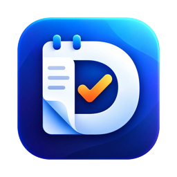

<p align="center">
  
</p>

<h1 align="center">DGE</h1>

<p align="center">할 일 · 일정 · 메모를 한곳에서 다루는 macOS 앱</p>

## 무엇을 할 수 있나요

- **할 일**: 수신함 · 오늘 · 예정 · 완료 · 목록 · 태그. 우선순위, 체크리스트, 반복, 알림, 내일로 미루기, 여러 개 한꺼번에 처리
- **빠른 입력**: `내일 오후 3시 보고서 #업무 !! @업무 매주`처럼 적으면 날짜 · 알림 · 태그 · 우선순위 · 목록 · 반복을 알아서 나눠 넣습니다
- **어디서나 입력**: 다른 앱을 쓰다가도 `⌃⌥Space`로 한 줄 입력 창을 띄웁니다
- **캘린더**: 일 · 주 · 월 보기, 할 일과 일정을 함께 보고 끌어서 옮기기. macOS 캘린더(iCloud · Google 등) 일정도 함께 보기(읽기 전용)
- **메모**: 회의 메모, 데일리 스크럼 메모(어제 한 일 · 오늘 할 일 · 오늘 일정을 할 일 기록에서 자동으로 채움, 내일 것 미리 준비 가능), 메모의 줄을 바로 할 일로
- **⌘K 검색 · 명령**, 메뉴 막대 · 미니 창, Dock 배지, 아침 요약 알림, 테마 · 글자 크기, 백업 내보내기 · 가져오기

## 설치

1. [Releases](../../releases)에서 최신 `DGE-x.y.zip`을 받아 압축을 풉니다.
2. `DGE.app`을 `응용 프로그램` 폴더로 옮깁니다.
3. 처음 열 때 "확인되지 않은 개발자" 경고가 뜹니다. (Apple 공증을 받지 않은 개인 앱이라서입니다)
   - `DGE.app`을 **우클릭 › 열기 › 열기**, 또는
   - **시스템 설정 › 개인정보 보호 및 보안**에서 아래쪽의 **그래도 열기**를 누릅니다.

   터미널을 쓴다면 아래 한 줄로도 됩니다.
   ```bash
   xattr -dr com.apple.quarantine /Applications/DGE.app
   ```

**요구 사항**: macOS 26 이상

## 직접 빌드하기

Xcode 26 이상이 필요합니다.

```bash
git clone https://github.com/minzzun99/DGE.git
cd DGE
xcodebuild -project DGE.xcodeproj -scheme DGE -configuration Release -derivedDataPath build build
open build/Build/Products/Release
```

## 단축키

| 동작 | 키 |
|---|---|
| 새 할 일 (메모 화면에서는 새 메모) | ⌘N |
| 검색 · 명령 | ⌘K |
| 빠른 입력 창 | ⇧⌘N (어디서나: ⌃⌥Space) |
| 수신함 · 오늘 · 예정 · 캘린더 · 완료 · 메모 | ⌘1 – ⌘6 |
| 완료 / 완료 취소 | ⌘↩ |
| 오늘로 · 내일로 · 다음 주로 | ⌘T · ⇧⌘T · ⌥⌘T |
| 우선순위 높음 · 보통 · 낮음 · 없음 | ⌃3 · ⌃2 · ⌃1 · ⌃0 |
| 메모의 줄을 할 일로 | ⇧⌘↩ |

요구사항과 설계 결정은 [docs/REQUIREMENTS.md](docs/REQUIREMENTS.md)에 있습니다.
